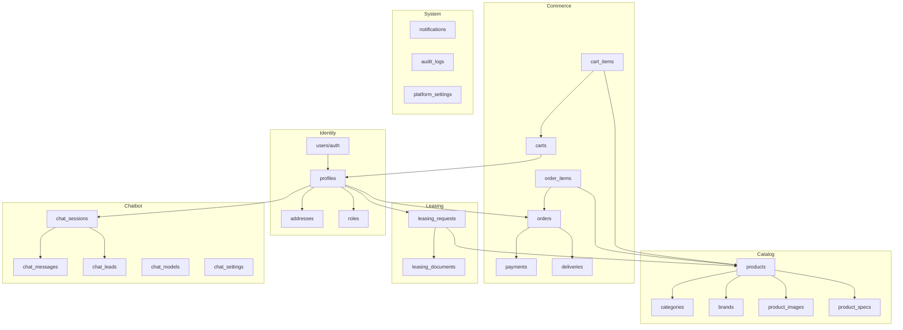

# 🗄️ MongolDrone — Backend Data Model & API Specification
## Part 1: Database Design + Schema + Enums

---

## 1. Database Design Overview

### Domain Map



### Design Principles

| Principle | Implementation |
|-----------|---------------|
| **Supabase-native auth** | `auth.users` is the source of truth; `profiles` extends it |
| **Soft deletes** | Products, orders use `status` fields, never hard delete |
| **MNT currency** | All monetary values stored as `NUMERIC(14,2)` in Mongolian Tugrik |
| **Bilingual fields** | `name_mn` (required) + `name_en` (optional) pattern |
| **Audit everything** | `created_at`, `updated_at` on all tables; `audit_logs` for admin actions |
| **JSON for flexible data** | Specs, metadata, settings use `JSONB` |
| **UUID primary keys** | All tables use `UUID` via `gen_random_uuid()` |
| **RLS enforced** | Every table has Row Level Security policies |

---

## 2. Database Schema

### 2.1 Identity Domain

#### `profiles`
> Extends Supabase `auth.users`. One row per user (customer or admin).

```sql
CREATE TABLE public.profiles (
    id            UUID PRIMARY KEY REFERENCES auth.users(id) ON DELETE CASCADE,
    role          TEXT NOT NULL DEFAULT 'customer',
    full_name     TEXT,
    phone         TEXT,
    email         TEXT,
    avatar_url    TEXT,
    locale        TEXT DEFAULT 'mn',
    is_active     BOOLEAN DEFAULT true,
    metadata      JSONB DEFAULT '{}',
    created_at    TIMESTAMPTZ DEFAULT now(),
    updated_at    TIMESTAMPTZ DEFAULT now()
);

-- Auto-create profile on signup
CREATE OR REPLACE FUNCTION public.handle_new_user()
RETURNS TRIGGER AS $$
BEGIN
    INSERT INTO public.profiles (id, full_name, email, avatar_url)
    VALUES (
        NEW.id,
        COALESCE(NEW.raw_user_meta_data->>'full_name', NEW.raw_user_meta_data->>'name'),
        NEW.email,
        NEW.raw_user_meta_data->>'avatar_url'
    );
    RETURN NEW;
END;
$$ LANGUAGE plpgsql SECURITY DEFINER;

CREATE TRIGGER on_auth_user_created
    AFTER INSERT ON auth.users
    FOR EACH ROW EXECUTE FUNCTION public.handle_new_user();
```

#### `roles`
> Defines available roles and their permissions.

```sql
CREATE TABLE public.roles (
    id            UUID PRIMARY KEY DEFAULT gen_random_uuid(),
    name          TEXT UNIQUE NOT NULL,  -- 'super_admin','admin','sales_manager','support_manager','content_manager','customer'
    display_name  TEXT NOT NULL,         -- 'Ерөнхий админ', 'Админ', etc.
    permissions   JSONB DEFAULT '{}',   -- {"products.write": true, "orders.read": true, ...}
    is_system     BOOLEAN DEFAULT false, -- System roles can't be deleted
    created_at    TIMESTAMPTZ DEFAULT now()
);

-- Seed default roles
INSERT INTO roles (name, display_name, permissions, is_system) VALUES
('super_admin', 'Ерөнхий админ', '{"*": true}', true),
('admin', 'Админ', '{"products.*": true, "orders.*": true, "leasing.*": true, "customers.read": true, "chatbot.*": true, "notifications.*": true, "settings.read": true}', true),
('sales_manager', 'Борлуулалтын менежер', '{"orders.*": true, "customers.read": true, "leasing.read": true, "chatbot.read": true, "notifications.own": true}', true),
('support_manager', 'Дэмжлэгийн менежер', '{"chatbot.*": true, "customers.read": true, "notifications.own": true}', true),
('content_manager', 'Контент менежер', '{"products.*": true, "categories.*": true, "brands.*": true}', true),
('customer', 'Хэрэглэгч', '{"own.*": true}', true);
```

#### `addresses`
> Delivery addresses for users. Structured for Mongolian geography.

```sql
CREATE TABLE public.addresses (
    id            UUID PRIMARY KEY DEFAULT gen_random_uuid(),
    user_id       UUID NOT NULL REFERENCES profiles(id) ON DELETE CASCADE,
    label         TEXT DEFAULT 'Гэр',       -- 'Гэр', 'Оффис', etc.
    city          TEXT NOT NULL,              -- 'Улаанбаатар', aimag name
    district      TEXT,                       -- Дүүрэг (UB) or Сум (aimag)
    khoroo        TEXT,                       -- Хороо number (UB only)
    street        TEXT,
    building      TEXT,
    apartment     TEXT,
    full_address  TEXT NOT NULL,              -- Complete human-readable address
    phone         TEXT,
    is_default    BOOLEAN DEFAULT false,
    created_at    TIMESTAMPTZ DEFAULT now(),
    updated_at    TIMESTAMPTZ DEFAULT now()
);

CREATE INDEX idx_addresses_user ON addresses(user_id);
```

### 2.2 Catalog Domain

#### `categories`
```sql
CREATE TABLE public.categories (
    id            UUID PRIMARY KEY DEFAULT gen_random_uuid(),
    parent_id     UUID REFERENCES categories(id) ON DELETE SET NULL,
    name_mn       TEXT NOT NULL,
    name_en       TEXT,
    slug          TEXT UNIQUE NOT NULL,
    description   TEXT,
    image_url     TEXT,
    sort_order    INT DEFAULT 0,
    is_active     BOOLEAN DEFAULT true,
    created_at    TIMESTAMPTZ DEFAULT now(),
    updated_at    TIMESTAMPTZ DEFAULT now()
);
```

#### `brands`
```sql
CREATE TABLE public.brands (
    id            UUID PRIMARY KEY DEFAULT gen_random_uuid(),
    name          TEXT UNIQUE NOT NULL,      -- 'DJI', 'Autel', 'Skydio'
    slug          TEXT UNIQUE NOT NULL,
    logo_url      TEXT,
    description   TEXT,
    website_url   TEXT,
    is_active     BOOLEAN DEFAULT true,
    created_at    TIMESTAMPTZ DEFAULT now()
);
```

#### `products`
```sql
CREATE TABLE public.products (
    id              UUID PRIMARY KEY DEFAULT gen_random_uuid(),
    category_id     UUID REFERENCES categories(id) ON DELETE SET NULL,
    brand_id        UUID REFERENCES brands(id) ON DELETE SET NULL,
    sku             TEXT UNIQUE NOT NULL,
    name_mn         TEXT NOT NULL,
    name_en         TEXT,
    slug            TEXT UNIQUE NOT NULL,
    description_mn  TEXT,
    description_en  TEXT,
    short_desc_mn   TEXT,                       -- For cards/listings (max 120 chars)
    price           NUMERIC(14,2) NOT NULL,     -- MNT
    compare_price   NUMERIC(14,2),              -- Original price for discount display
    cost_price      NUMERIC(14,2),              -- Internal cost (admin only)
    currency        TEXT DEFAULT 'MNT',
    stock_qty       INT DEFAULT 0,
    low_stock_threshold INT DEFAULT 3,
    is_leasable     BOOLEAN DEFAULT false,
    weight_grams    INT,
    status          TEXT DEFAULT 'draft',        -- draft, active, archived
    is_featured     BOOLEAN DEFAULT false,
    tags            TEXT[] DEFAULT '{}',
    seo_title       TEXT,
    seo_description TEXT,
    view_count      INT DEFAULT 0,
    created_at      TIMESTAMPTZ DEFAULT now(),
    updated_at      TIMESTAMPTZ DEFAULT now()
);

CREATE INDEX idx_products_category ON products(category_id);
CREATE INDEX idx_products_brand ON products(brand_id);
CREATE INDEX idx_products_status ON products(status) WHERE status = 'active';
CREATE INDEX idx_products_slug ON products(slug);
CREATE INDEX idx_products_featured ON products(is_featured) WHERE is_featured = true;
CREATE INDEX idx_products_search ON products
    USING GIN (to_tsvector('simple', coalesce(name_mn,'') || ' ' || coalesce(name_en,'') || ' ' || coalesce(description_mn,'')));
```

#### `product_images`
```sql
CREATE TABLE public.product_images (
    id            UUID PRIMARY KEY DEFAULT gen_random_uuid(),
    product_id    UUID NOT NULL REFERENCES products(id) ON DELETE CASCADE,
    url           TEXT NOT NULL,
    alt_text      TEXT,
    sort_order    INT DEFAULT 0,
    is_thumbnail  BOOLEAN DEFAULT false,
    created_at    TIMESTAMPTZ DEFAULT now()
);

CREATE INDEX idx_product_images_product ON product_images(product_id);
```

#### `product_specs`
```sql
CREATE TABLE public.product_specs (
    id            UUID PRIMARY KEY DEFAULT gen_random_uuid(),
    product_id    UUID NOT NULL REFERENCES products(id) ON DELETE CASCADE,
    group_name    TEXT DEFAULT 'Ерөнхий',     -- 'Ерөнхий', 'Камер', 'Нислэг', 'Батарей'
    spec_key      TEXT NOT NULL,               -- 'flight_time', 'camera_resolution'
    label_mn      TEXT NOT NULL,               -- 'Нислэгийн хугацаа'
    label_en      TEXT,                        -- 'Flight Time'
    value         TEXT NOT NULL,               -- '43 мин'
    sort_order    INT DEFAULT 0
);

CREATE INDEX idx_product_specs_product ON product_specs(product_id);
```

### 2.3 Commerce Domain

#### `carts`
```sql
CREATE TABLE public.carts (
    id            UUID PRIMARY KEY DEFAULT gen_random_uuid(),
    user_id       UUID REFERENCES profiles(id) ON DELETE CASCADE,
    session_id    TEXT,                          -- For anonymous carts
    status        TEXT DEFAULT 'active',         -- active, merged, abandoned, converted
    expires_at    TIMESTAMPTZ DEFAULT (now() + interval '30 days'),
    created_at    TIMESTAMPTZ DEFAULT now(),
    updated_at    TIMESTAMPTZ DEFAULT now(),
    CONSTRAINT cart_owner CHECK (user_id IS NOT NULL OR session_id IS NOT NULL)
);

CREATE INDEX idx_carts_user ON carts(user_id) WHERE status = 'active';
```

#### `cart_items`
```sql
CREATE TABLE public.cart_items (
    id            UUID PRIMARY KEY DEFAULT gen_random_uuid(),
    cart_id       UUID NOT NULL REFERENCES carts(id) ON DELETE CASCADE,
    product_id    UUID NOT NULL REFERENCES products(id) ON DELETE CASCADE,
    quantity      INT NOT NULL DEFAULT 1 CHECK (quantity > 0 AND quantity <= 10),
    unit_price    NUMERIC(14,2) NOT NULL,       -- Price snapshot at time of add
    created_at    TIMESTAMPTZ DEFAULT now(),
    updated_at    TIMESTAMPTZ DEFAULT now(),
    UNIQUE(cart_id, product_id)
);
```

#### `orders`
```sql
CREATE TABLE public.orders (
    id              UUID PRIMARY KEY DEFAULT gen_random_uuid(),
    order_number    TEXT UNIQUE NOT NULL,         -- MND-YYYYMMDD-NNNN
    user_id         UUID NOT NULL REFERENCES profiles(id),
    status          TEXT DEFAULT 'pending',
    subtotal        NUMERIC(14,2) NOT NULL,
    shipping_cost   NUMERIC(14,2) DEFAULT 0,
    discount_amount NUMERIC(14,2) DEFAULT 0,
    total           NUMERIC(14,2) NOT NULL,
    currency        TEXT DEFAULT 'MNT',
    -- Shipping snapshot
    shipping_address JSONB NOT NULL,
    shipping_method  TEXT DEFAULT 'standard',
    -- Contact
    contact_name    TEXT NOT NULL,
    contact_phone   TEXT NOT NULL,
    -- Internal
    notes           TEXT,                         -- Customer notes
    admin_notes     TEXT,                         -- Internal admin notes
    assigned_to     UUID REFERENCES profiles(id),
    source          TEXT DEFAULT 'web',           -- web, chatbot, admin
    created_at      TIMESTAMPTZ DEFAULT now(),
    updated_at      TIMESTAMPTZ DEFAULT now()
);

CREATE INDEX idx_orders_user ON orders(user_id);
CREATE INDEX idx_orders_status ON orders(status);
CREATE INDEX idx_orders_number ON orders(order_number);
CREATE INDEX idx_orders_created ON orders(created_at DESC);
```

#### `order_items`
```sql
CREATE TABLE public.order_items (
    id            UUID PRIMARY KEY DEFAULT gen_random_uuid(),
    order_id      UUID NOT NULL REFERENCES orders(id) ON DELETE CASCADE,
    product_id    UUID REFERENCES products(id) ON DELETE SET NULL,
    product_snapshot JSONB NOT NULL,              -- Full product data at purchase time
    quantity      INT NOT NULL CHECK (quantity > 0),
    unit_price    NUMERIC(14,2) NOT NULL,
    total_price   NUMERIC(14,2) NOT NULL,
    created_at    TIMESTAMPTZ DEFAULT now()
);

CREATE INDEX idx_order_items_order ON order_items(order_id);
```

#### `payments`
```sql
CREATE TABLE public.payments (
    id              UUID PRIMARY KEY DEFAULT gen_random_uuid(),
    order_id        UUID NOT NULL REFERENCES orders(id),
    method          TEXT NOT NULL,                 -- qpay, socialpay, bank_transfer
    status          TEXT DEFAULT 'pending',
    amount          NUMERIC(14,2) NOT NULL,
    currency        TEXT DEFAULT 'MNT',
    -- Provider data
    provider_ref    TEXT,                           -- External payment ID from QPay/SocialPay
    provider_data   JSONB DEFAULT '{}',            -- Full response from provider
    invoice_url     TEXT,                           -- QPay QR code URL
    -- Bank transfer specifics
    receipt_url     TEXT,                           -- Uploaded receipt photo
    verified_by     UUID REFERENCES profiles(id),
    verified_at     TIMESTAMPTZ,
    -- Timing
    expires_at      TIMESTAMPTZ,                   -- Payment deadline
    paid_at         TIMESTAMPTZ,
    created_at      TIMESTAMPTZ DEFAULT now(),
    updated_at      TIMESTAMPTZ DEFAULT now()
);

CREATE INDEX idx_payments_order ON payments(order_id);
CREATE INDEX idx_payments_status ON payments(status) WHERE status = 'pending';
CREATE INDEX idx_payments_provider_ref ON payments(provider_ref);
```

#### `deliveries`
```sql
CREATE TABLE public.deliveries (
    id              UUID PRIMARY KEY DEFAULT gen_random_uuid(),
    order_id        UUID NOT NULL REFERENCES orders(id),
    status          TEXT DEFAULT 'pending',
    method          TEXT DEFAULT 'standard',       -- standard, express, pickup
    tracking_number TEXT,
    carrier         TEXT,                           -- Delivery company name
    estimated_date  DATE,
    shipped_at      TIMESTAMPTZ,
    delivered_at    TIMESTAMPTZ,
    delivery_notes  TEXT,
    recipient_name  TEXT,
    recipient_phone TEXT,
    proof_photo_url TEXT,                           -- Delivery confirmation photo
    created_at      TIMESTAMPTZ DEFAULT now(),
    updated_at      TIMESTAMPTZ DEFAULT now()
);

CREATE INDEX idx_deliveries_order ON deliveries(order_id);
CREATE INDEX idx_deliveries_status ON deliveries(status);
```

### 2.4 Leasing Domain

#### `leasing_requests`
```sql
CREATE TABLE public.leasing_requests (
    id              UUID PRIMARY KEY DEFAULT gen_random_uuid(),
    request_number  TEXT UNIQUE NOT NULL,          -- LSR-YYYYMMDD-NNNN
    user_id         UUID REFERENCES profiles(id),
    product_id      UUID NOT NULL REFERENCES products(id),
    status          TEXT DEFAULT 'submitted',
    -- Contact
    contact_name    TEXT NOT NULL,
    contact_phone   TEXT NOT NULL,
    contact_email   TEXT,
    -- Business info
    company_name    TEXT,
    register_number TEXT,                           -- Business registration number
    -- Lease terms
    requested_months INT NOT NULL CHECK (requested_months BETWEEN 3 AND 36),
    monthly_budget   NUMERIC(14,2),
    purpose          TEXT,                           -- Usage description
    -- Processing
    assigned_to     UUID REFERENCES profiles(id),
    admin_notes     TEXT,
    approved_terms  JSONB,                          -- {monthly_payment, down_payment, total, interest_rate}
    reviewed_at     TIMESTAMPTZ,
    -- Source
    source          TEXT DEFAULT 'web',             -- web, chatbot
    created_at      TIMESTAMPTZ DEFAULT now(),
    updated_at      TIMESTAMPTZ DEFAULT now()
);

CREATE INDEX idx_leasing_user ON leasing_requests(user_id);
CREATE INDEX idx_leasing_status ON leasing_requests(status);
```

#### `leasing_documents`
```sql
CREATE TABLE public.leasing_documents (
    id              UUID PRIMARY KEY DEFAULT gen_random_uuid(),
    request_id      UUID NOT NULL REFERENCES leasing_requests(id) ON DELETE CASCADE,
    doc_type        TEXT NOT NULL,                   -- 'business_registration', 'financial_statement', 'id_card'
    file_url        TEXT NOT NULL,
    file_name       TEXT NOT NULL,
    file_size       INT,
    uploaded_at     TIMESTAMPTZ DEFAULT now()
);
```

### 2.5 Chatbot Domain

#### `chat_sessions`
```sql
CREATE TABLE public.chat_sessions (
    id              UUID PRIMARY KEY DEFAULT gen_random_uuid(),
    user_id         UUID REFERENCES profiles(id),
    visitor_id      TEXT,                             -- Fingerprint for anonymous
    status          TEXT DEFAULT 'active',            -- active, closed, escalated
    model_id        UUID REFERENCES chat_models(id),
    total_tokens    INT DEFAULT 0,
    message_count   INT DEFAULT 0,
    source_page     TEXT,                             -- URL where chat was started
    created_at      TIMESTAMPTZ DEFAULT now(),
    updated_at      TIMESTAMPTZ DEFAULT now(),
    closed_at       TIMESTAMPTZ
);

CREATE INDEX idx_chat_sessions_user ON chat_sessions(user_id);
CREATE INDEX idx_chat_sessions_status ON chat_sessions(status) WHERE status = 'active';
```

#### `chat_messages`
```sql
CREATE TABLE public.chat_messages (
    id              UUID PRIMARY KEY DEFAULT gen_random_uuid(),
    session_id      UUID NOT NULL REFERENCES chat_sessions(id) ON DELETE CASCADE,
    role            TEXT NOT NULL,                    -- user, assistant, system, tool
    content         TEXT NOT NULL,
    rich_content    JSONB,                            -- Product cards, forms, carousels
    tool_calls      JSONB,                            -- [{name, arguments, result}]
    tokens_input    INT DEFAULT 0,
    tokens_output   INT DEFAULT 0,
    latency_ms      INT,                              -- Response time
    created_at      TIMESTAMPTZ DEFAULT now()
);

CREATE INDEX idx_chat_messages_session ON chat_messages(session_id);
CREATE INDEX idx_chat_messages_created ON chat_messages(created_at);
```

#### `chat_leads`
```sql
CREATE TABLE public.chat_leads (
    id              UUID PRIMARY KEY DEFAULT gen_random_uuid(),
    session_id      UUID NOT NULL REFERENCES chat_sessions(id),
    user_id         UUID REFERENCES profiles(id),
    name            TEXT NOT NULL,
    phone           TEXT NOT NULL,
    email           TEXT,
    interest        TEXT,                              -- Product/topic of interest
    product_id      UUID REFERENCES products(id),
    status          TEXT DEFAULT 'new',                -- new, contacted, qualified, converted, lost
    assigned_to     UUID REFERENCES profiles(id),
    admin_notes     TEXT,
    contacted_at    TIMESTAMPTZ,
    created_at      TIMESTAMPTZ DEFAULT now(),
    updated_at      TIMESTAMPTZ DEFAULT now()
);

CREATE INDEX idx_chat_leads_status ON chat_leads(status);
```

#### `chat_models`
```sql
CREATE TABLE public.chat_models (
    id              UUID PRIMARY KEY DEFAULT gen_random_uuid(),
    provider        TEXT NOT NULL DEFAULT 'openai',   -- openai, anthropic, etc.
    model_name      TEXT NOT NULL,                     -- gpt-4o-mini, gpt-4o
    display_name    TEXT NOT NULL,                     -- 'GPT-4o Mini'
    is_active       BOOLEAN DEFAULT true,
    is_default      BOOLEAN DEFAULT false,
    config          JSONB DEFAULT '{}',                -- {temperature, max_tokens, top_p}
    cost_per_1k_input  NUMERIC(8,4),                  -- For internal tracking
    cost_per_1k_output NUMERIC(8,4),
    created_at      TIMESTAMPTZ DEFAULT now(),
    updated_at      TIMESTAMPTZ DEFAULT now()
);

INSERT INTO chat_models (model_name, display_name, is_default, config, cost_per_1k_input, cost_per_1k_output) VALUES
('gpt-4o-mini', 'GPT-4o Mini — Хурдан', true, '{"temperature": 0.7, "max_tokens": 2048}', 0.00015, 0.0006),
('gpt-4o', 'GPT-4o — Чанартай', false, '{"temperature": 0.5, "max_tokens": 4096}', 0.005, 0.015);
```

#### `chat_settings`
```sql
CREATE TABLE public.chat_settings (
    id              UUID PRIMARY KEY DEFAULT gen_random_uuid(),
    key             TEXT UNIQUE NOT NULL,
    value           JSONB NOT NULL,
    updated_by      UUID REFERENCES profiles(id),
    updated_at      TIMESTAMPTZ DEFAULT now()
);

INSERT INTO chat_settings (key, value) VALUES
('enabled', 'true'),
('system_prompt', '"Та бол MongolDrone компанийн AI туслах..."'),
('welcome_message', '"Сайн байна уу! 👋 Би MongolDrone-ийн AI зөвлөх. Танд яаж туслах вэ?"'),
('max_tokens_per_session', '8000'),
('lead_capture_threshold', '3'),
('quick_replies', '["Дрон хайх","Үнэ мэдэх","Лизинг","Хүргэлт"]');
```

### 2.6 System Domain

#### `notifications`
```sql
CREATE TABLE public.notifications (
    id              UUID PRIMARY KEY DEFAULT gen_random_uuid(),
    recipient_id    UUID REFERENCES profiles(id),
    recipient_role  TEXT,                               -- Broadcast to role
    type            TEXT NOT NULL,
    title           TEXT NOT NULL,
    body            TEXT,
    data            JSONB DEFAULT '{}',                 -- {entity_type, entity_id, url}
    channel         TEXT DEFAULT 'in_app',              -- in_app, telegram, email
    is_read         BOOLEAN DEFAULT false,
    read_at         TIMESTAMPTZ,
    created_at      TIMESTAMPTZ DEFAULT now()
);

CREATE INDEX idx_notif_recipient ON notifications(recipient_id);
CREATE INDEX idx_notif_unread ON notifications(recipient_id, is_read) WHERE NOT is_read;
```

#### `audit_logs`
```sql
CREATE TABLE public.audit_logs (
    id              UUID PRIMARY KEY DEFAULT gen_random_uuid(),
    actor_id        UUID REFERENCES profiles(id),
    action          TEXT NOT NULL,                      -- 'order.status_changed', 'product.created'
    entity_type     TEXT NOT NULL,                      -- 'order', 'product', 'leasing_request'
    entity_id       UUID NOT NULL,
    old_value       JSONB,
    new_value       JSONB,
    ip_address      INET,
    user_agent      TEXT,
    created_at      TIMESTAMPTZ DEFAULT now()
);

CREATE INDEX idx_audit_entity ON audit_logs(entity_type, entity_id);
CREATE INDEX idx_audit_actor ON audit_logs(actor_id);
CREATE INDEX idx_audit_created ON audit_logs(created_at DESC);
```

#### `platform_settings`
```sql
CREATE TABLE public.platform_settings (
    key             TEXT PRIMARY KEY,
    value           JSONB NOT NULL,
    updated_by      UUID REFERENCES profiles(id),
    updated_at      TIMESTAMPTZ DEFAULT now()
);

INSERT INTO platform_settings (key, value) VALUES
('delivery_fees', '{"ub_standard": 5000, "ub_express": 15000, "aimag": 25000, "free_threshold": 500000}'),
('payment_methods', '{"qpay": true, "socialpay": false, "bank_transfer": true}'),
('business_info', '{"phone": "+976-7700-1234", "email": "info@mongoldrone.mn", "address": "..."}');
```

---

## 3. Status Enums

### Order Status
```typescript
enum OrderStatus {
    PENDING      = 'pending',       // Захиалга үүссэн, төлбөр хүлээж буй
    CONFIRMED    = 'confirmed',     // Төлбөр баталгаажсан
    PROCESSING   = 'processing',    // Бэлтгэж байна
    SHIPPED      = 'shipped',       // Хүргэлтэнд гарсан
    DELIVERED    = 'delivered',     // Хүргэгдсэн
    CANCELLED    = 'cancelled',    // Цуцлагдсан
    REFUNDED     = 'refunded'      // Буцаалт хийгдсэн
}
// Valid transitions: pending→confirmed→processing→shipped→delivered
//                    pending→cancelled, confirmed→cancelled→refunded
```

### Payment Status
```typescript
enum PaymentStatus {
    PENDING      = 'pending',       // Invoice created, waiting
    PROCESSING   = 'processing',    // Provider is processing
    PAID         = 'paid',          // Confirmed paid
    FAILED       = 'failed',       // Payment failed
    EXPIRED      = 'expired',      // Invoice expired (15 min)
    REFUNDED     = 'refunded',     // Money returned
    CANCELLED    = 'cancelled'     // Cancelled before payment
}
```

### Delivery Status
```typescript
enum DeliveryStatus {
    PENDING      = 'pending',       // Not yet shipped
    PREPARING    = 'preparing',    // Being packaged
    SHIPPED      = 'shipped',      // In transit
    IN_TRANSIT   = 'in_transit',   // For aimag deliveries
    DELIVERED    = 'delivered',    // Received by customer
    RETURNED     = 'returned',    // Returned to sender
    FAILED       = 'failed'       // Delivery failed
}
```

### Leasing Status
```typescript
enum LeasingStatus {
    SUBMITTED    = 'submitted',     // Application received
    UNDER_REVIEW = 'under_review', // Being reviewed
    INFO_NEEDED  = 'info_needed',  // More documents required
    APPROVED     = 'approved',     // Approved with terms
    REJECTED     = 'rejected',     // Application denied
    ACTIVE       = 'active',       // Lease is active
    COMPLETED    = 'completed',    // Fully paid off
    CANCELLED    = 'cancelled'     // Cancelled by either party
}
```

### Chat Lead Status
```typescript
enum ChatLeadStatus {
    NEW          = 'new',           // Just captured
    CONTACTED    = 'contacted',    // Sales called/messaged
    QUALIFIED    = 'qualified',    // Genuine interest confirmed
    CONVERTED    = 'converted',    // Made a purchase
    LOST         = 'lost'          // Not interested / unreachable
}
```

### Notification Types
```typescript
enum NotificationType {
    NEW_ORDER        = 'new_order',
    ORDER_STATUS     = 'order_status',
    PAYMENT_RECEIVED = 'payment_received',
    PAYMENT_FAILED   = 'payment_failed',
    NEW_LEAD         = 'new_lead',
    CHAT_ESCALATION  = 'chat_escalation',
    LEASING_REQUEST  = 'leasing_request',
    LEASING_UPDATE   = 'leasing_update',
    LOW_STOCK        = 'low_stock',
    SYSTEM           = 'system'
}
```

### Chat Model Status
```typescript
// Controlled via chat_models table fields
// is_active: true/false — whether the model can be selected
// is_default: true/false — only one model can be default at a time
```

---

## Order Number Generation

```sql
CREATE OR REPLACE FUNCTION generate_order_number()
RETURNS TEXT AS $$
DECLARE
    today TEXT;
    seq INT;
BEGIN
    today := to_char(now(), 'YYYYMMDD');
    SELECT COUNT(*) + 1 INTO seq 
    FROM orders 
    WHERE order_number LIKE 'MND-' || today || '-%';
    RETURN 'MND-' || today || '-' || lpad(seq::TEXT, 4, '0');
END;
$$ LANGUAGE plpgsql;

-- Same pattern for leasing: LSR-YYYYMMDD-NNNN
CREATE OR REPLACE FUNCTION generate_leasing_number()
RETURNS TEXT AS $$
DECLARE
    today TEXT;
    seq INT;
BEGIN
    today := to_char(now(), 'YYYYMMDD');
    SELECT COUNT(*) + 1 INTO seq 
    FROM leasing_requests 
    WHERE request_number LIKE 'LSR-' || today || '-%';
    RETURN 'LSR-' || today || '-' || lpad(seq::TEXT, 4, '0');
END;
$$ LANGUAGE plpgsql;
```
