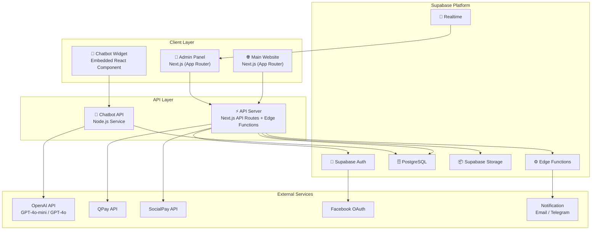
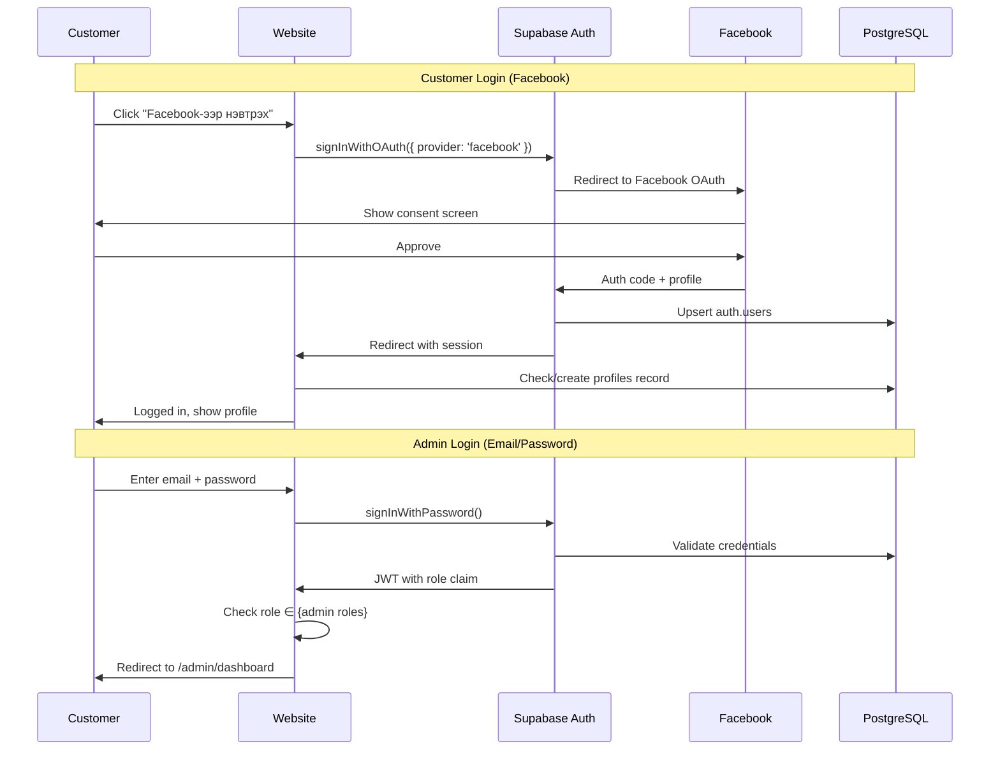
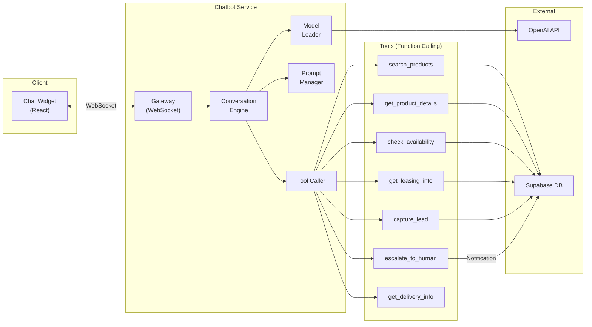
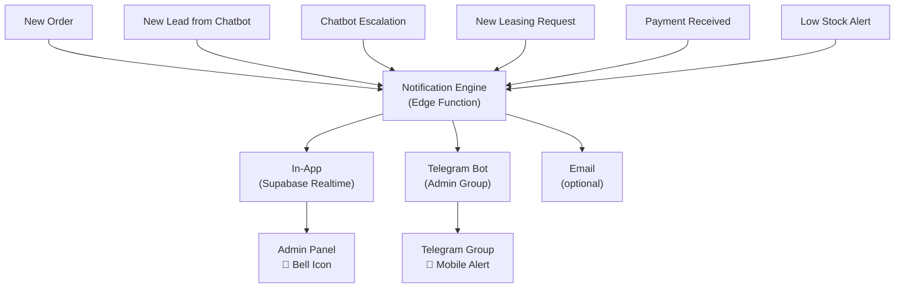
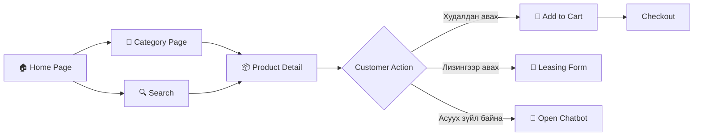
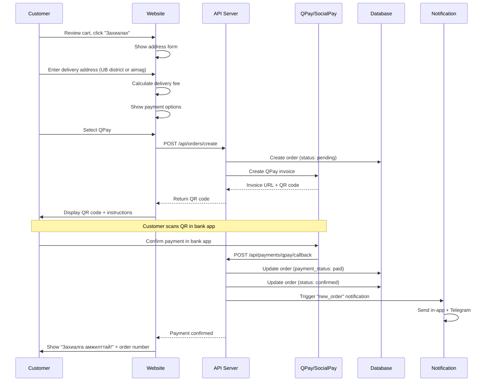
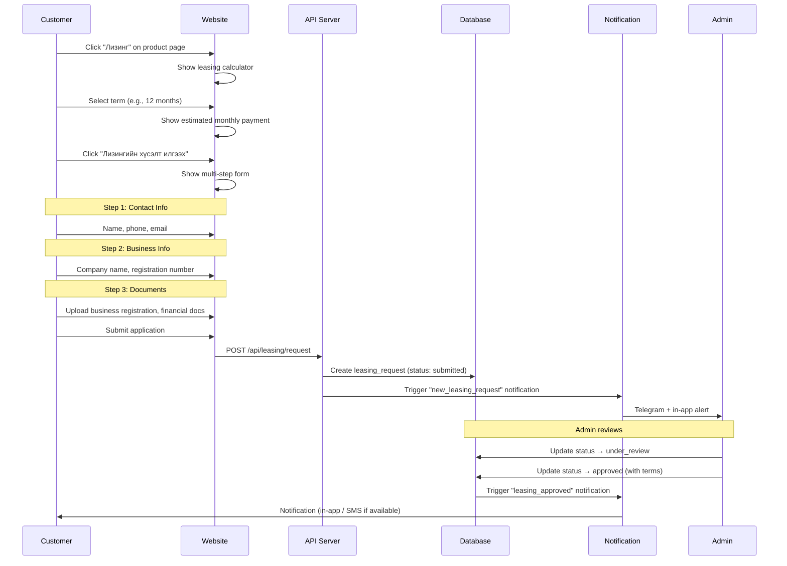
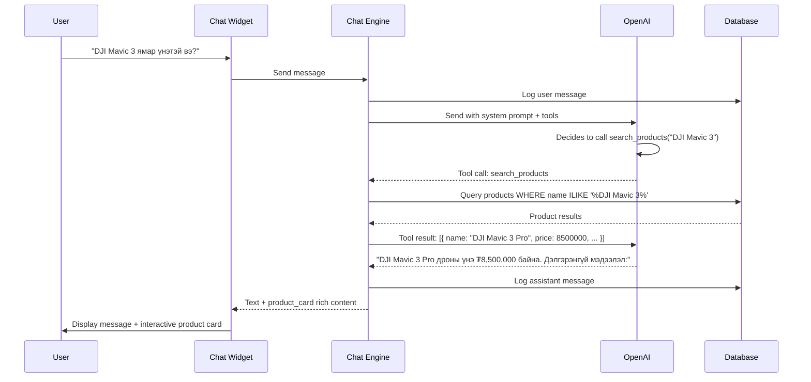
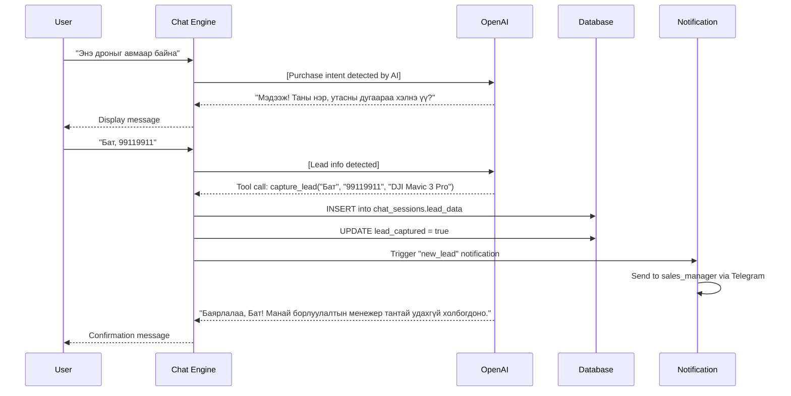
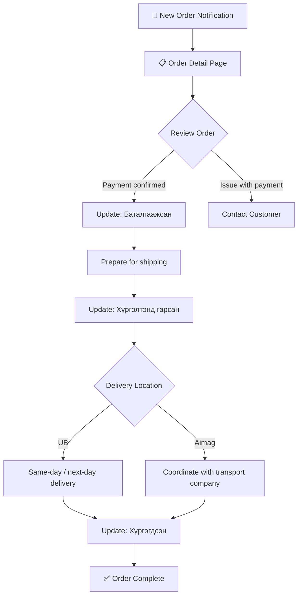

# 🚁 MongolDrone — Commercial Drone Sales Platform
## Complete Product & System Specification

---

## 1. Product Overview

### What It Is
A full-stack ecommerce platform purpose-built for selling commercial and consumer drones in Mongolia. The platform combines a modern storefront, an AI-powered Mongolian-language chatbot, and a back-office admin panel into a single unified system.

### Who It Is For

| User Type | Description |
|-----------|-------------|
| **End Customers** | Mongolian businesses (mining, agriculture, surveying, media) and individuals looking to purchase or lease drones |
| **Sales Team** | Internal staff managing orders, leads, and customer relationships |
| **Support Team** | Staff handling chatbot escalations and customer inquiries |
| **Content Managers** | Staff managing product catalog, media, and site content |
| **Administrators** | Business owners and IT staff managing the platform |

### Core Business Value
1. **First-mover advantage** — No dedicated drone ecommerce platform exists in Mongolia
2. **AI-assisted sales** — 24/7 Mongolian-language chatbot reduces sales team workload by handling product inquiries and lead capture
3. **Leasing enablement** — Unlocks enterprise sales by offering structured leasing for expensive commercial drones
4. **Operational efficiency** — Centralized admin panel replaces spreadsheets and fragmented communication

### Market Context — Mongolia Specifics
- **Population**: ~3.4M, heavily concentrated in Ulaanbaatar (~1.5M)
- **Mobile penetration**: >95% — mobile-first is mandatory, not optional
- **Social media**: Facebook dominates (~2.5M users) — Facebook login is essential
- **Payment**: QPay and SocialPay are the dominant mobile payment methods; bank transfers (Khan Bank, Golomt, TDB) for larger B2B transactions
- **Language**: Mongolian Cyrillic script; all customer-facing UI must be in Mongolian
- **Delivery**: Limited infrastructure outside UB; delivery logistics need manual coordination for aimag (province) deliveries

---

## 2. Full System Architecture

### 2.1 High-Level Architecture



### 2.2 Frontend Architecture

#### Monorepo Structure (Turborepo)

```
mongol-drone/
├── apps/
│   ├── web/                    # Main customer-facing website
│   │   ├── app/
│   │   │   ├── (store)/        # Product pages, checkout
│   │   │   ├── (account)/      # Profile, orders
│   │   │   ├── (leasing)/      # Leasing info & forms
│   │   │   ├── api/            # API routes
│   │   │   └── layout.tsx      # Root layout with Mongolian font
│   │   └── components/
│   │       ├── chatbot/        # Embedded chatbot widget
│   │       ├── product/        # Product cards, carousels
│   │       ├── checkout/       # Payment forms
│   │       └── ui/             # Shared UI components
│   │
│   └── admin/                  # Admin panel (separate Next.js app)
│       ├── app/
│       │   ├── dashboard/
│       │   ├── products/
│       │   ├── orders/
│       │   ├── leasing/
│       │   ├── customers/
│       │   ├── chatbot/
│       │   ├── notifications/
│       │   └── settings/
│       └── components/
│
├── packages/
│   ├── ui/                     # Shared component library
│   ├── types/                  # Shared TypeScript types
│   ├── supabase/               # Supabase client & helpers
│   └── utils/                  # Shared utilities
│
├── supabase/
│   ├── migrations/             # Database migrations
│   ├── functions/              # Edge functions
│   └── seed.sql                # Seed data
│
└── services/
    └── chatbot/                # Chatbot backend service
        ├── src/
        │   ├── engine.ts       # Conversation engine
        │   ├── tools.ts        # Function calling tools
        │   ├── prompts.ts      # System prompts (Mongolian)
        │   └── models.ts       # Model config & switching
        └── package.json
```

#### Key Frontend Decisions

| Decision | Choice | Rationale |
|----------|--------|-----------|
| Framework | Next.js 14+ App Router | SSR for SEO on product pages, RSC for performance |
| Styling | Tailwind CSS + shadcn/ui | Rapid development, consistent design system |
| State Management | Zustand + React Query | Zustand for client state, React Query for server state |
| Internationalization | next-intl | Mongolian as primary, English as secondary |
| Font | Inter + Mongolian system fonts | Inter for Latin, system Cyrillic for Mongolian |
| Forms | React Hook Form + Zod | Type-safe validation |
| Chatbot Widget | Custom React component | Embedded in main site, iframe for third-party embed |

### 2.3 Backend Architecture

#### API Design Philosophy
- **Next.js API Routes** for standard CRUD operations (products, orders, users)
- **Supabase Edge Functions** for webhooks, payment callbacks, notifications
- **Dedicated Node.js service** for chatbot (needs persistent context, streaming, tool-calling)

#### API Route Structure

```
/api/
├── auth/
│   ├── callback          # OAuth callback handler
│   └── session           # Session management
├── products/
│   ├── [id]              # GET single product
│   ├── search            # Full-text search (Mongolian)
│   └── categories        # Category tree
├── cart/
│   └── [action]          # add, remove, update
├── orders/
│   ├── create            # Create order + initiate payment
│   ├── [id]              # Order details
│   └── [id]/status       # Update status (admin)
├── leasing/
│   ├── request           # Submit leasing application
│   └── [id]              # Application status
├── payments/
│   ├── qpay/create       # Create QPay invoice
│   ├── qpay/callback     # QPay webhook
│   ├── socialpay/create  # Create SocialPay invoice
│   └── socialpay/callback # SocialPay webhook
├── chatbot/
│   ├── message           # Send message (proxied to chatbot service)
│   └── sessions          # Chat session management
├── admin/
│   ├── dashboard         # Analytics data
│   ├── users             # User management
│   └── settings          # Platform settings
└── notifications/
    └── subscribe         # Push notification subscription
```

### 2.4 Supabase Usage

| Supabase Feature | Usage |
|-----------------|-------|
| **Auth** | Facebook OAuth, email/password for admin, session management, RLS policies |
| **PostgreSQL** | All application data — products, orders, users, chat logs, leasing requests |
| **Storage** | Product images, user avatars, leasing documents, chatbot attachments |
| **Realtime** | Admin notification feed, order status updates, chatbot typing indicators |
| **Edge Functions** | Payment webhooks, notification dispatch, scheduled tasks |
| **RLS (Row Level Security)** | Per-user data isolation, role-based data access |

#### Core Database Schema

```sql
-- =============================================
-- USERS & AUTH
-- =============================================
CREATE TABLE public.profiles (
    id UUID PRIMARY KEY REFERENCES auth.users(id) ON DELETE CASCADE,
    full_name TEXT,
    phone TEXT,
    avatar_url TEXT,
    locale TEXT DEFAULT 'mn',
    role TEXT DEFAULT 'customer' CHECK (role IN (
        'customer', 'super_admin', 'admin', 'sales_manager', 
        'support_manager', 'content_manager'
    )),
    metadata JSONB DEFAULT '{}',
    created_at TIMESTAMPTZ DEFAULT NOW(),
    updated_at TIMESTAMPTZ DEFAULT NOW()
);

-- =============================================
-- PRODUCT CATALOG
-- =============================================
CREATE TABLE public.categories (
    id UUID PRIMARY KEY DEFAULT gen_random_uuid(),
    name_mn TEXT NOT NULL,          -- Mongolian name
    name_en TEXT,                    -- English name (optional)
    slug TEXT UNIQUE NOT NULL,
    parent_id UUID REFERENCES categories(id),
    sort_order INT DEFAULT 0,
    is_active BOOLEAN DEFAULT true,
    created_at TIMESTAMPTZ DEFAULT NOW()
);

CREATE TABLE public.products (
    id UUID PRIMARY KEY DEFAULT gen_random_uuid(),
    category_id UUID REFERENCES categories(id),
    sku TEXT UNIQUE NOT NULL,
    name_mn TEXT NOT NULL,
    name_en TEXT,
    slug TEXT UNIQUE NOT NULL,
    description_mn TEXT,
    description_en TEXT,
    specs JSONB DEFAULT '{}',       -- { "weight": "249g", "flight_time": "31 min", ... }
    price NUMERIC(12,2) NOT NULL,   -- Price in MNT (Mongolian Tugrik)
    compare_price NUMERIC(12,2),    -- Original price for discounts
    currency TEXT DEFAULT 'MNT',
    stock_quantity INT DEFAULT 0,
    is_leasable BOOLEAN DEFAULT false,
    lease_terms JSONB,              -- { "min_months": 6, "max_months": 24, "monthly_rate": ... }
    images TEXT[] DEFAULT '{}',     -- Array of storage URLs
    thumbnail_url TEXT,
    status TEXT DEFAULT 'draft' CHECK (status IN ('draft', 'active', 'archived')),
    tags TEXT[] DEFAULT '{}',
    seo_title TEXT,
    seo_description TEXT,
    created_at TIMESTAMPTZ DEFAULT NOW(),
    updated_at TIMESTAMPTZ DEFAULT NOW()
);

CREATE INDEX idx_products_category ON products(category_id);
CREATE INDEX idx_products_status ON products(status);
CREATE INDEX idx_products_slug ON products(slug);

-- Full-text search index for Mongolian
CREATE INDEX idx_products_search ON products 
    USING GIN (to_tsvector('simple', coalesce(name_mn, '') || ' ' || coalesce(description_mn, '')));

-- =============================================
-- ORDERS & PAYMENTS
-- =============================================
CREATE TABLE public.orders (
    id UUID PRIMARY KEY DEFAULT gen_random_uuid(),
    order_number TEXT UNIQUE NOT NULL,   -- MND-20260401-0001
    user_id UUID REFERENCES profiles(id),
    status TEXT DEFAULT 'pending' CHECK (status IN (
        'pending', 'confirmed', 'processing', 'shipped', 
        'delivered', 'cancelled', 'refunded'
    )),
    items JSONB NOT NULL,               -- Snapshot of ordered items
    subtotal NUMERIC(12,2) NOT NULL,
    shipping_cost NUMERIC(12,2) DEFAULT 0,
    total NUMERIC(12,2) NOT NULL,
    currency TEXT DEFAULT 'MNT',
    shipping_address JSONB,             -- { "city": "UB", "district": "...", ... }
    payment_method TEXT,                -- 'qpay', 'socialpay', 'bank_transfer'
    payment_status TEXT DEFAULT 'unpaid' CHECK (payment_status IN (
        'unpaid', 'pending', 'paid', 'failed', 'refunded'
    )),
    payment_reference TEXT,             -- External payment ID
    notes TEXT,
    assigned_to UUID REFERENCES profiles(id),  -- Sales manager
    created_at TIMESTAMPTZ DEFAULT NOW(),
    updated_at TIMESTAMPTZ DEFAULT NOW()
);

CREATE TABLE public.order_status_history (
    id UUID PRIMARY KEY DEFAULT gen_random_uuid(),
    order_id UUID REFERENCES orders(id) ON DELETE CASCADE,
    status TEXT NOT NULL,
    changed_by UUID REFERENCES profiles(id),
    note TEXT,
    created_at TIMESTAMPTZ DEFAULT NOW()
);

-- =============================================
-- LEASING
-- =============================================
CREATE TABLE public.leasing_requests (
    id UUID PRIMARY KEY DEFAULT gen_random_uuid(),
    request_number TEXT UNIQUE NOT NULL,  -- LSR-20260401-0001
    user_id UUID REFERENCES profiles(id),
    product_id UUID REFERENCES products(id),
    status TEXT DEFAULT 'submitted' CHECK (status IN (
        'submitted', 'under_review', 'approved', 'rejected', 
        'active', 'completed', 'cancelled'
    )),
    -- Applicant info
    company_name TEXT,
    register_number TEXT,               -- Mongolian business registration
    contact_name TEXT NOT NULL,
    contact_phone TEXT NOT NULL,
    contact_email TEXT,
    -- Lease terms
    requested_months INT NOT NULL,
    monthly_budget NUMERIC(12,2),
    purpose TEXT,                        -- How they'll use the drone
    -- Documents
    documents TEXT[] DEFAULT '{}',       -- Storage URLs
    -- Processing
    assigned_to UUID REFERENCES profiles(id),
    admin_notes TEXT,
    approved_terms JSONB,               -- Final approved lease terms
    created_at TIMESTAMPTZ DEFAULT NOW(),
    updated_at TIMESTAMPTZ DEFAULT NOW()
);

-- =============================================
-- CHATBOT
-- =============================================
CREATE TABLE public.chat_sessions (
    id UUID PRIMARY KEY DEFAULT gen_random_uuid(),
    user_id UUID REFERENCES profiles(id),  -- NULL for anonymous
    visitor_fingerprint TEXT,               -- Anonymous tracking
    status TEXT DEFAULT 'active' CHECK (status IN (
        'active', 'closed', 'escalated'
    )),
    model_used TEXT DEFAULT 'gpt-4o-mini',
    lead_captured BOOLEAN DEFAULT false,
    lead_data JSONB,                       -- { "name": "", "phone": "", "interest": "" }
    metadata JSONB DEFAULT '{}',
    created_at TIMESTAMPTZ DEFAULT NOW(),
    updated_at TIMESTAMPTZ DEFAULT NOW()
);

CREATE TABLE public.chat_messages (
    id UUID PRIMARY KEY DEFAULT gen_random_uuid(),
    session_id UUID REFERENCES chat_sessions(id) ON DELETE CASCADE,
    role TEXT NOT NULL CHECK (role IN ('user', 'assistant', 'system', 'tool')),
    content TEXT NOT NULL,
    rich_content JSONB,                    -- Product cards, carousels, forms
    tool_calls JSONB,                      -- Function calling log
    tokens_used INT,
    created_at TIMESTAMPTZ DEFAULT NOW()
);

CREATE INDEX idx_chat_messages_session ON chat_messages(session_id);

-- =============================================
-- NOTIFICATIONS
-- =============================================
CREATE TABLE public.notifications (
    id UUID PRIMARY KEY DEFAULT gen_random_uuid(),
    recipient_id UUID REFERENCES profiles(id),
    recipient_role TEXT,                    -- Broadcast to role
    type TEXT NOT NULL,                     -- 'new_order', 'new_lead', 'escalation', etc.
    title TEXT NOT NULL,
    body TEXT,
    data JSONB DEFAULT '{}',               -- { "order_id": "...", "url": "/admin/orders/..." }
    is_read BOOLEAN DEFAULT false,
    channel TEXT DEFAULT 'in_app',         -- 'in_app', 'telegram', 'email'
    created_at TIMESTAMPTZ DEFAULT NOW()
);

CREATE INDEX idx_notifications_recipient ON notifications(recipient_id);
CREATE INDEX idx_notifications_unread ON notifications(recipient_id, is_read) WHERE NOT is_read;

-- =============================================
-- PLATFORM SETTINGS
-- =============================================
CREATE TABLE public.platform_settings (
    key TEXT PRIMARY KEY,
    value JSONB NOT NULL,
    updated_by UUID REFERENCES profiles(id),
    updated_at TIMESTAMPTZ DEFAULT NOW()
);

-- Initial settings
INSERT INTO platform_settings (key, value) VALUES
    ('chatbot_config', '{"default_model": "gpt-4o-mini", "available_models": ["gpt-4o-mini", "gpt-4o"], "enabled": true, "system_prompt_version": 1}'),
    ('payment_config', '{"qpay_enabled": true, "socialpay_enabled": true, "bank_transfer_enabled": true}'),
    ('delivery_config', '{"ub_delivery_fee": 5000, "aimag_delivery_fee": 15000, "free_delivery_threshold": 500000}'),
    ('leasing_config', '{"min_months": 3, "max_months": 24, "requires_registration": true}');
```

### 2.5 Auth Flow



#### Auth Implementation Details
- **Customers** → Facebook OAuth only (primary), optional email/password
- **Admin users** → Email/password only (no social login for security)
- **Session duration** → 7 days with refresh tokens
- **Role stored in** → `profiles.role` column, synced to JWT claims via Supabase hook
- **RLS policies** → All tables protected; customers see only own data; admin roles see scoped data

### 2.6 Chatbot Architecture



#### Chatbot System Prompt Strategy

```typescript
// Simplified system prompt structure
const SYSTEM_PROMPT = `
Та бол MongolDrone компанийн AI туслах юм. 
Таны үүрэг бол хэрэглэгчдэд дрон бүтээгдэхүүний талаар 
мэдээлэл өгөх, зөвлөгөө өгөх, захиалга хийхэд туслах.

RULES:
1. Always respond in Mongolian
2. Be helpful, professional, friendly
3. When the user asks about a product → call search_products
4. When the user shows purchase intent → call capture_lead
5. When you cannot answer → call escalate_to_human
6. Never invent product info — always use tool results
7. For pricing, always show MNT (₮) amounts

AVAILABLE TOOLS:
- search_products(query): Search product catalog
- get_product_details(id): Get full product info + specs
- check_availability(id): Check stock status
- get_leasing_info(product_id): Get leasing options
- capture_lead(name, phone, interest): Save customer lead
- escalate_to_human(reason): Transfer to human agent
- get_delivery_info(location): Get delivery options & cost
`;
```

#### Rich Message Types

```typescript
type ChatMessage = {
  role: 'user' | 'assistant';
  content: string;
  rich_content?: 
    | { type: 'product_card'; product: Product }
    | { type: 'product_carousel'; products: Product[] }
    | { type: 'leasing_form'; product_id: string }
    | { type: 'lead_form'; fields: string[] }
    | { type: 'order_summary'; order: OrderPreview }
    | { type: 'escalation_notice'; ticket_id: string };
};
```

### 2.7 Notification Flow



#### Why Telegram for Admin Notifications?
In Mongolia, Telegram is widely used for business communication. Sending order/lead notifications to a Telegram group ensures admins get instant mobile alerts without needing to keep the admin panel open. This is critical for a small team.

### 2.8 External Integration Approach

| Integration | Provider | Method | Priority |
|-------------|----------|--------|----------|
| **Payment — Mobile** | QPay | REST API | MVP |
| **Payment — Mobile** | SocialPay | REST API | MVP |
| **Payment — Bank** | Manual bank transfer | Verification UI | MVP |
| **Auth — Social** | Facebook | Supabase OAuth | MVP |
| **AI — Chat** | OpenAI | API (streaming) | MVP |
| **Notifications** | Telegram Bot API | REST API | MVP |
| **Email** | Resend or Mailgun | REST API | Post-MVP |
| **Analytics** | Google Analytics 4 | Client SDK | MVP |
| **SMS** | Mongolian SMS gateway (Unitel/Mobicom) | REST API | Post-MVP |

---

## 3. Feature Breakdown by Module

### 3.1 Main Website

| # | Feature | Description | Complexity |
|---|---------|-------------|------------|
| W1 | **Home Page** | Hero banner, featured products, categories, value props, CTA | Medium |
| W2 | **Product Listing** | Filterable grid (category, price, specs), pagination, search | Medium |
| W3 | **Product Detail** | Image gallery, specs table, price, stock status, leasing CTA, related products | Medium |
| W4 | **Shopping Cart** | Add/remove items, quantity, persistent cart (localStorage + DB sync) | Medium |
| W5 | **Checkout Flow** | Address form, payment method selection, QPay/SocialPay integration, order confirmation | High |
| W6 | **User Auth** | Facebook login, profile creation, session management | Low |
| W7 | **User Profile** | Edit profile, change phone, avatar | Low |
| W8 | **Order History** | List orders, order detail, status tracking | Medium |
| W9 | **Leasing Info Page** | Static content: how leasing works, requirements, calculator | Low |
| W10 | **Leasing Request Form** | Multi-step form: product selection, company info, documents upload | Medium |
| W11 | **Search** | Full-text product search with Mongolian support | Medium |
| W12 | **SEO Optimization** | Meta tags, OG tags, structured data (Product schema) | Low |
| W13 | **Mobile Responsiveness** | All pages fully responsive, bottom nav on mobile | Medium |
| W14 | **Mongolian Localization** | All UI strings in Mongolian, date/currency formatting (₮) | Medium |

### 3.2 AI Chatbot

| # | Feature | Description | Complexity |
|---|---------|-------------|------------|
| C1 | **Chat Widget** | Floating button, expandable panel, mobile fullscreen | Medium |
| C2 | **Mongolian Conversation** | Natural language in Mongolian with proper context | High |
| C3 | **Product Search Tool** | AI calls search_products, renders product cards | High |
| C4 | **Product Carousel** | Horizontal scrollable product cards in chat | Medium |
| C5 | **Product Detail Tool** | AI fetches and presents detailed product info | Medium |
| C6 | **Leasing Info Tool** | AI explains leasing options for specific products | Medium |
| C7 | **Lead Capture** | AI detects purchase intent, collects name + phone | High |
| C8 | **Human Escalation** | Transfers to human with full context; notifies admin | Medium |
| C9 | **Model Selection** | Admin can switch between GPT-4o-mini / GPT-4o | Low |
| C10 | **Conversation Logging** | All messages stored with metadata | Low |
| C11 | **Session Management** | Persistent sessions for logged-in users, fingerprint for anonymous | Medium |
| C12 | **Streaming Responses** | Token-by-token streaming for natural feel | Medium |
| C13 | **Fallback Responses** | Graceful handling when AI or API fails | Low |
| C14 | **Delivery Info Tool** | AI provides delivery timeline and cost by location | Low |

### 3.3 Admin Panel

| # | Feature | Description | Complexity |
|---|---------|-------------|------------|
| A1 | **Dashboard** | Order count, revenue, leads, active chats, charts | Medium |
| A2 | **Product Management** | CRUD products, image upload, bulk status change | Medium |
| A3 | **Category Management** | CRUD categories, tree structure, reordering | Low |
| A4 | **Order Management** | List/filter orders, change status, assign to sales, print invoice | High |
| A5 | **Order Detail** | Full order view, status history, payment info, customer info | Medium |
| A6 | **Delivery Management** | Track deliveries, update shipping status, delivery notes | Medium |
| A7 | **Leasing Management** | Review applications, approve/reject, attach terms | Medium |
| A8 | **Customer Management** | View customers, order history, chat history, notes | Medium |
| A9 | **Chatbot Settings** | Enable/disable, model selection, edit system prompt, view logs | Medium |
| A10 | **Chat Log Viewer** | Browse conversations, filter by lead/escalation, export | Medium |
| A11 | **Notification Center** | In-app notifications feed, mark read, filter by type | Medium |
| A12 | **User Management** | Create admin/staff accounts, assign roles | Low |
| A13 | **Platform Settings** | Payment config, delivery fees, leasing terms | Low |
| A14 | **Analytics** | Revenue trends, top products, conversion rates, chatbot effectiveness | High |
| A15 | **Role-Based Access** | UI elements and API routes gated by role | Medium |

### 3.4 Shared Services

| # | Service | Description |
|---|---------|-------------|
| S1 | **Auth Service** | Session management, role resolution, RLS policy enforcement |
| S2 | **Notification Service** | Dispatch notifications across channels (in-app, Telegram) |
| S3 | **File Upload Service** | Image optimization, storage management via Supabase Storage |
| S4 | **Search Service** | PostgreSQL full-text search with Mongolian text support |
| S5 | **Payment Service** | QPay/SocialPay abstraction layer, payment status tracking |
| S6 | **Audit Logger** | Log admin actions (status changes, role changes, deletions) |

---

## 4. User Roles & Permission Matrix

### Role Definitions

| Role | Description | Typical User |
|------|-------------|-------------|
| `super_admin` | Full system access, can manage other admins | Business owner, CTO |
| `admin` | Full operational access, cannot manage super_admin | Operations manager |
| `sales_manager` | Manages orders, customers, leads | Sales team lead |
| `support_manager` | Manages chatbot, escalations, customer support | Support team lead |
| `content_manager` | Manages products, categories, site content | Marketing team |
| `customer` | Browses, purchases, uses chatbot | End customer |

### Permission Matrix

| Resource | Action | super_admin | admin | sales_manager | support_manager | content_manager | customer |
|----------|--------|:-----------:|:-----:|:-------------:|:---------------:|:---------------:|:--------:|
| **Dashboard** | View | ✅ | ✅ | ✅ (sales only) | ✅ (support only) | ❌ | ❌ |
| **Products** | View | ✅ | ✅ | ✅ | ✅ | ✅ | ✅ (public) |
| **Products** | Create/Edit | ✅ | ✅ | ❌ | ❌ | ✅ | ❌ |
| **Products** | Delete | ✅ | ✅ | ❌ | ❌ | ❌ | ❌ |
| **Orders** | View all | ✅ | ✅ | ✅ | ❌ | ❌ | Own only |
| **Orders** | Update status | ✅ | ✅ | ✅ | ❌ | ❌ | ❌ |
| **Orders** | Cancel/Refund | ✅ | ✅ | ❌ | ❌ | ❌ | Own (pending) |
| **Leasing** | View requests | ✅ | ✅ | ✅ | ❌ | ❌ | Own only |
| **Leasing** | Approve/Reject | ✅ | ✅ | ❌ | ❌ | ❌ | ❌ |
| **Customers** | View profiles | ✅ | ✅ | ✅ | ✅ | ❌ | Own only |
| **Chatbot** | View logs | ✅ | ✅ | ✅ | ✅ | ❌ | ❌ |
| **Chatbot** | Change settings | ✅ | ✅ | ❌ | ✅ | ❌ | ❌ |
| **Chatbot** | Handle escalation | ✅ | ✅ | ✅ | ✅ | ❌ | ❌ |
| **Notifications** | View | ✅ | ✅ | ✅ (own) | ✅ (own) | ✅ (own) | ❌ |
| **Users (Admin)** | Manage | ✅ | ❌ | ❌ | ❌ | ❌ | ❌ |
| **Settings** | Platform config | ✅ | ✅ | ❌ | ❌ | ❌ | ❌ |
| **Analytics** | Full reports | ✅ | ✅ | Sales reports | Support reports | ❌ | ❌ |

---

## 5. Core Business Flows

### 5.1 Product Browsing Flow



### 5.2 Checkout Flow



### 5.3 Leasing Request Flow



### 5.4 Chatbot Inquiry Flow



### 5.5 Chatbot Lead Capture Flow



### 5.6 Admin Order Handling Flow



---

## 6. MVP Scope

### 🔴 Must-Have (MVP v1.0) — Launch in 6-8 weeks

| Module | Features | IDs |
|--------|----------|-----|
| **Website** | Home page, product listing, product detail, cart, checkout (QPay), Facebook login, user profile, order history, mobile responsive, Mongolian UI | W1-W8, W13-W14 |
| **Chatbot** | Chat widget, Mongolian conversation (GPT-4o-mini), product search tool, product cards, lead capture, conversation logging, fallback responses | C1-C3, C5, C7, C10, C13 |
| **Admin** | Dashboard (basic), product CRUD, order management, customer list, notification center (in-app + Telegram), basic auth/roles | A1-A5, A8, A11-A12, A15 |
| **Infra** | Supabase setup, RLS policies, QPay integration, deployment (Vercel + Railway/Render) | S1-S5 |

### 🟡 Should-Have (v1.1) — Weeks 9-12

| Module | Features | IDs |
|--------|----------|-----|
| **Website** | Leasing info page, leasing request form, product search, SEO optimization | W9-W12 |
| **Chatbot** | Product carousel, leasing info tool, human escalation, model selection, delivery info tool, streaming | C4, C6, C8-C9, C12, C14 |
| **Admin** | Delivery management, leasing management, chatbot settings, chat log viewer | A6-A7, A9-A10 |
| **Infra** | SocialPay integration, audit logging | S6 |

### 🟢 Later Phase (v2.0+) — Month 4+

| Feature | Description |
|---------|-------------|
| **SocialPay integration** | Second payment method |
| **SMS notifications** | Via Mongolian carrier API (Unitel/Mobicom) |
| **Email notifications** | Transactional emails for order confirmation |
| **Advanced analytics** | Revenue trends, funnel analysis, chatbot effectiveness |
| **Product comparisons** | Side-by-side drone comparison tool |
| **Review system** | Customer reviews and ratings |
| **Inventory alerts** | Low-stock automated notifications |
| **Multi-language** | English language support for international customers |
| **Wishlist** | Save products for later |
| **Blog/Content** | SEO-driven content marketing (drone guides, regulations) |
| **Mobile app** | React Native app (if demand justifies) |
| **Chatbot — voice** | Voice input in Mongolian |
| **Chatbot — WhatsApp/Facebook Messenger** | Multi-channel chatbot deployment |
| **B2B portal** | Dedicated enterprise purchasing with volume pricing |

---

## 7. Risks & Important Decisions

### 7.1 Payment Integration

| Risk | Impact | Mitigation |
|------|--------|------------|
| QPay API documentation is limited and mostly in Mongolian | Medium — slower integration | Budget extra time; contact QPay developer support early; reference existing open-source integrations |
| QPay sandbox environment may be unreliable | Medium — testing delays | Build a mock payment module for development; test with real QPay in staging |
| Payment callback reliability | High — missed payments | Implement polling fallback (check payment status every 30s for 15min after invoice creation) |
| SocialPay integration differences | Low | Defer to v1.1; abstract payment interface so SocialPay is a drop-in |

> [!IMPORTANT]
> **Decision needed**: Contact QPay for merchant account and API credentials ASAP. This is on the critical path and takes 1-2 weeks for approval.

### 7.2 Chatbot Risks

| Risk | Impact | Mitigation |
|------|--------|------------|
| GPT-4o-mini Mongolian quality | High — poor user experience | Test extensively; create Mongolian few-shot examples in system prompt; consider fine-tuning later |
| Hallucinated product info | High — customer trust | Strict tool-use-only approach; never let AI generate product details from memory |
| API costs at scale | Low (initially) | GPT-4o-mini is very cheap ($0.15/1M input tokens); monitor usage; set per-session token limits |
| Latency for Mongolian users | Medium | Use streaming; consider edge deployment; OpenAI's Asia endpoints |
| AI says something inappropriate | Medium | Content filtering in system prompt; log all conversations; human review capability |

> [!WARNING]
> **Critical design decision**: The chatbot must NEVER generate product specs, pricing, or availability from its training data. ALL product information must come from tool calls to the database. This is enforced via system prompt and validated in the conversation engine.

### 7.3 Scaling Concerns

| Concern | Current Risk | Notes |
|---------|:----------:|-------|
| Database load | 🟢 Low | Supabase Free/Pro tier handles initial traffic easily; Mongolia's market size is manageable |
| Concurrent chatbot sessions | 🟢 Low | Unlikely to exceed 50 concurrent sessions in first year |
| Image storage | 🟡 Medium | Optimize images on upload (WebP, max 1MB); Supabase Storage has generous limits |
| Vercel cold starts | 🟢 Low | App Router with RSC minimizes cold start impact |

**Verdict**: Scaling is NOT a real concern for the Mongolian market in the first 1-2 years. Do not over-engineer for scale. Focus on correctness and user experience.

### 7.4 Admin Complexity

| Risk | Impact | Mitigation |
|------|--------|------------|
| Too many features for small team | High — unused features | Start with essential CRUD; add features based on actual admin feedback |
| Complex role system for 2-3 person team | Medium — over-engineering | MVP: only `super_admin` and `admin` roles; add granular roles in v1.1 |
| Chat log review is time-consuming | Low | Add filters (leads only, escalations only); defer AI-summarized logs to v2 |

> [!TIP]
> **Practical advice**: For a Mongolian startup, the initial team is likely 2-5 people. Start with just `super_admin` + `admin` roles. Only implement `sales_manager`, `support_manager`, `content_manager` when the team actually grows large enough to need role separation.

### 7.5 Key Architecture Decisions

| Decision | Recommendation | Alternative Considered |
|----------|---------------|----------------------|
| **Monorepo vs separate repos** | Monorepo (Turborepo) | Separate repos — too much overhead for small team |
| **Chatbot: separate service vs API route** | Separate Node.js service | API route — insufficient for streaming + tool-calling complexity |
| **Admin: same app vs separate app** | Separate Next.js app in monorepo | Same app with route groups — separation of concerns is cleaner |
| **State management** | Zustand + React Query | Redux — overkill; Context — insufficient for complex state |
| **Deployment** | Vercel (web + admin) + Railway (chatbot service) | Self-hosted — unnecessary complexity |
| **Mongolian search** | PostgreSQL `tsvector` with 'simple' config | Algolia/Meilisearch — overkill for catalog size (<1000 products) |

---

## 8. Recommended MVP Scope

### Timeline: 6-8 weeks

### Week 1-2: Foundation
- [ ] Supabase project setup (database, auth, storage, RLS)
- [ ] Turborepo monorepo setup
- [ ] Shared packages (types, UI, supabase client)
- [ ] Design system setup (Tailwind + shadcn/ui + Mongolian typography)
- [ ] Facebook OAuth flow
- [ ] QPay merchant account application (start immediately)

### Week 3-4: Core Website
- [ ] Home page (hero, featured products, categories)
- [ ] Product listing page with filters
- [ ] Product detail page
- [ ] Shopping cart (client-side + DB sync)
- [ ] User profile & order history pages
- [ ] Mongolian localization for all UI strings

### Week 5-6: Checkout + Chatbot
- [ ] Checkout flow with address form
- [ ] QPay payment integration
- [ ] Bank transfer option (manual verification)
- [ ] Chatbot service setup (Node.js + OpenAI)
- [ ] Chat widget embedded in website
- [ ] Product search + detail tools
- [ ] Lead capture tool
- [ ] Conversation logging

### Week 7-8: Admin + Polish
- [ ] Admin login + basic dashboard
- [ ] Product management (CRUD + image upload)
- [ ] Order management (list, detail, status update)
- [ ] Notification center (in-app + Telegram)
- [ ] Customer list view
- [ ] End-to-end testing
- [ ] Mobile responsiveness polish
- [ ] Deployment to production

### Post-MVP priorities (in order):
1. Leasing module (info page + request form + admin management)
2. SocialPay integration
3. Chatbot enhancements (carousel, escalation, model switching)
4. Advanced analytics dashboard
5. SEO optimization + structured data

### Cost Estimates (Monthly)

| Service | Plan | Monthly Cost |
|---------|------|:------------:|
| Supabase | Pro | $25 |
| Vercel | Pro | $20 |
| Railway (chatbot) | Starter | $5-10 |
| OpenAI API | Pay-as-you-go | $10-50 |
| Domain (.mn) | Annual | ~$20/yr |
| **Total** | | **~$65-110/mo** |

> [!NOTE]
> These costs are extremely manageable for a Mongolian business. The platform can be profitable from a single drone sale (typical margin: ₮500,000-2,000,000 per unit).

---

*Document version: 1.0 | Created: 2026-04-01 | Author: System Architect*
